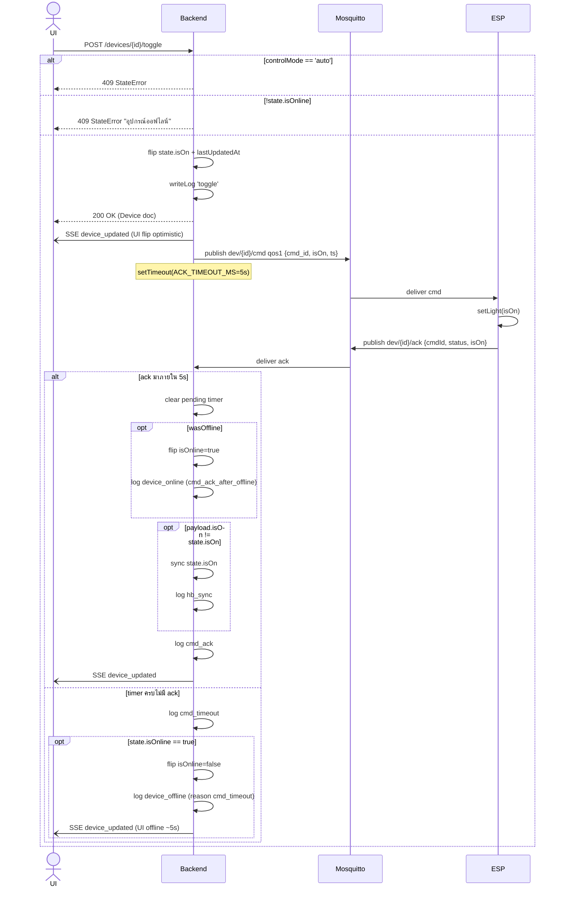
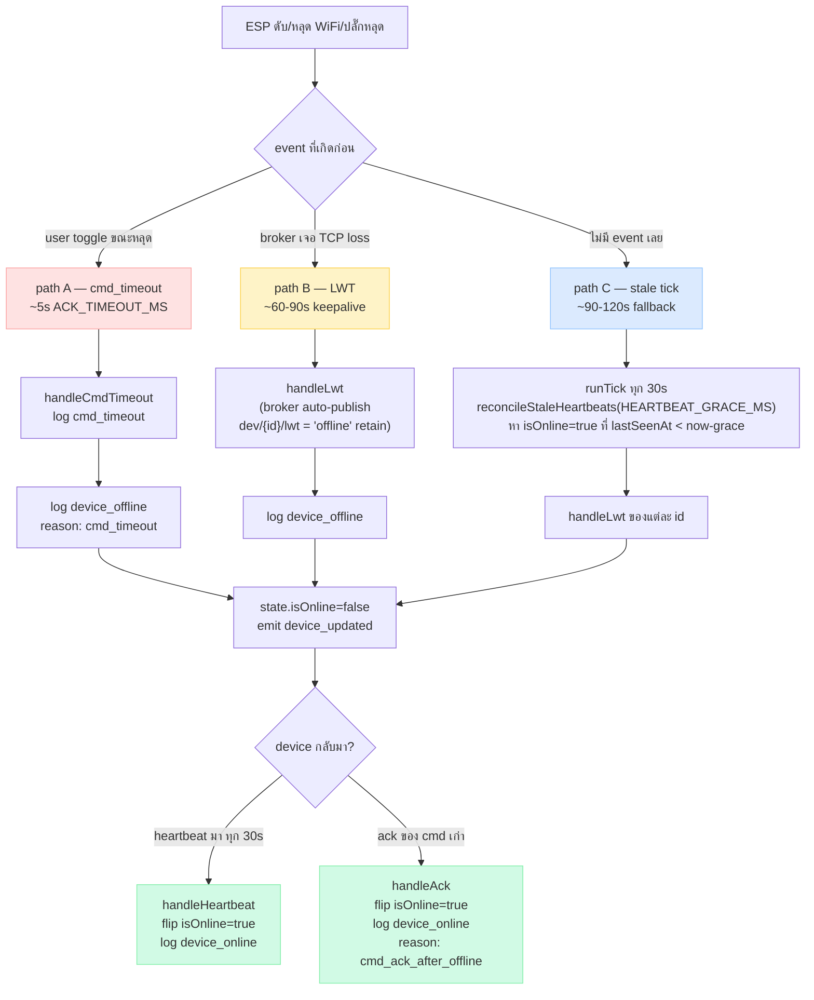
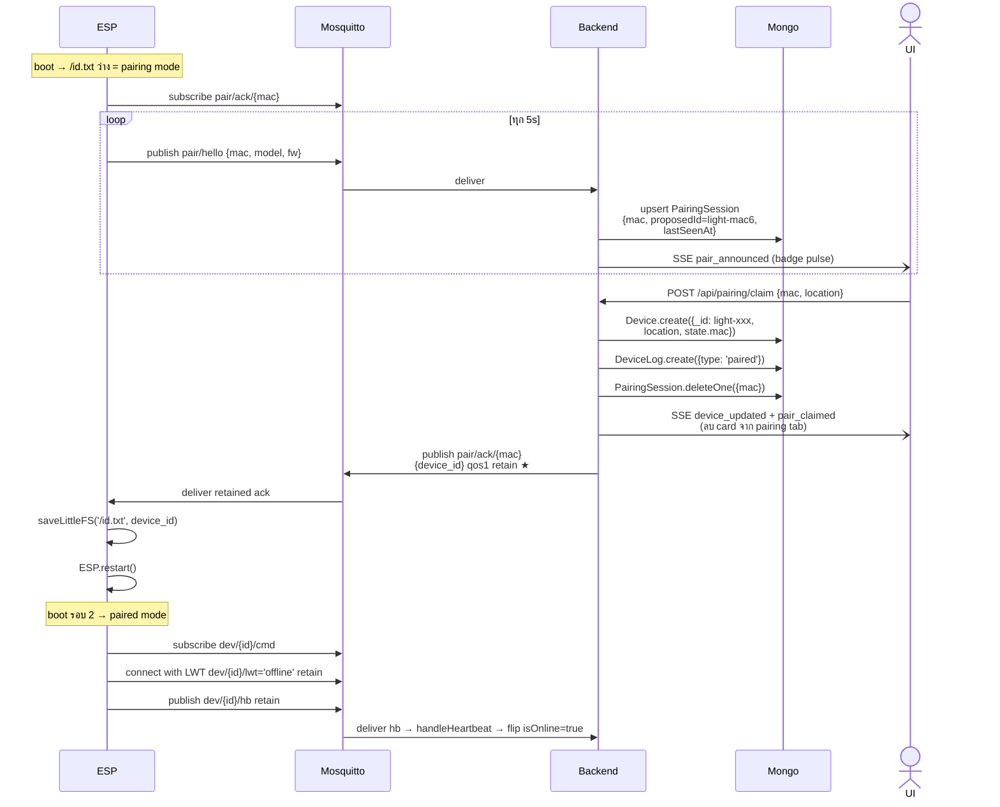
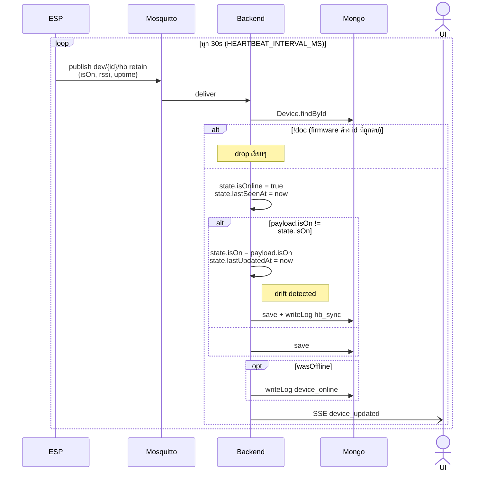
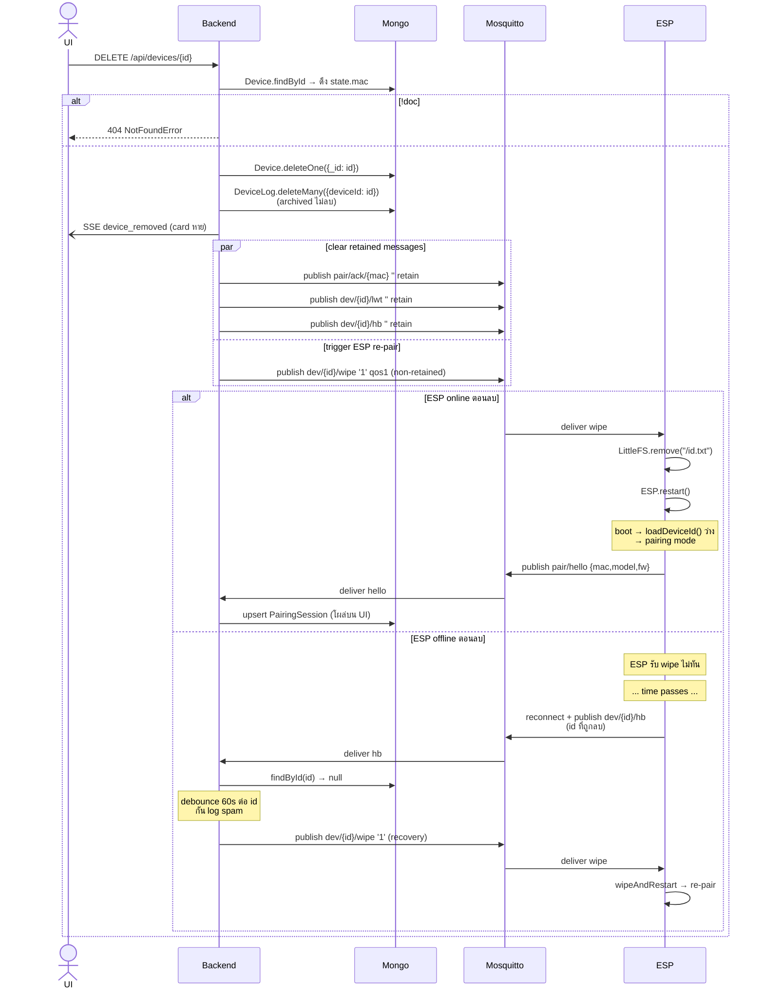
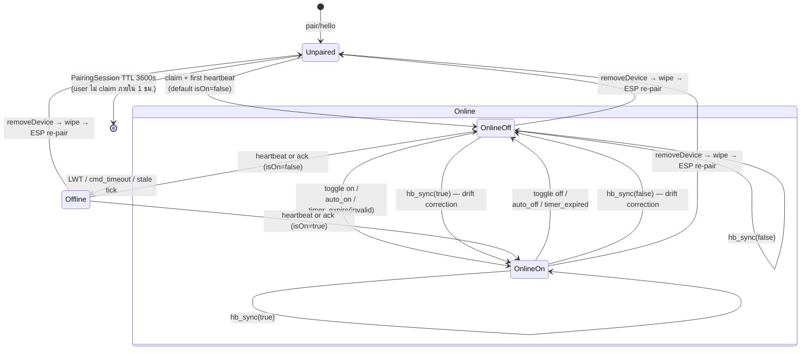
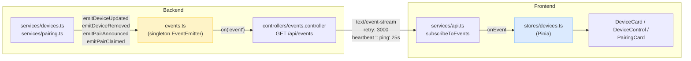

# Flow diagrams

Mermaid version ของ flow ทั้งหมดใน [`CLAUDE.md`](../CLAUDE.md) — render บน GitHub, VSCode (Mermaid Preview), Obsidian, mermaid.live

ASCII version (สำหรับ terminal) อยู่ที่ CLAUDE.md ฝั่งนี้คือ visual companion

## 1. Toggle / command lifecycle

## 2. Offline detection — 3 paths

## 3. Pairing (Announce & Claim)

## 4. Heartbeat & drift reconciliation

**เคสที่ `hb_sync` ทำงาน:**
- cmd หายระหว่าง MQTT relay (broker bug, QoS mismatch)
- ESP รีบูตเอง (watchdog/brownout) ระหว่าง apply cmd
- Backend optimistic flip แต่ ESP ตอน apply เจอ error (เช่น GPIO ติด)

## 5. Remove device + auto re-pair

**Non-retained wipe ตั้งใจ:** retained จะทำให้ ESP ที่ re-pair กลับมา (ID เดิม เพราะ MAC เดิม) subscribe `dev/{id}/wipe` แล้วได้ retained wipe → wipe ซ้ำ → infinite loop

## 6. Device state machine

**ลบไม่ใช่ terminal:** ตั้งแต่เพิ่ม `dev/{id}/wipe` ESP จะวนกลับเข้า `Unpaired` อัตโนมัติ (boot ใหม่ → publish hello) — เปลี่ยน "ลบแล้วต้อง flash ESP เอง" เป็น "ลบแล้วโผล่ pairing tab ทันที"

**ในมุม UI:**
- `Unpaired` → tab **Pairing**, card ลอย + ปุ่ม Claim
- `Online*` → tab **อุปกรณ์ทั้งหมด**, จุดสีเขียว + ปุ่ม toggle ใช้ได้
- `Offline` → tab **อุปกรณ์ทั้งหมด**, badge แดง "ออฟไลน์" + ปุ่ม toggle disable + หลอด dim

## 7. SSE pipeline (โครงสร้าง realtime)

